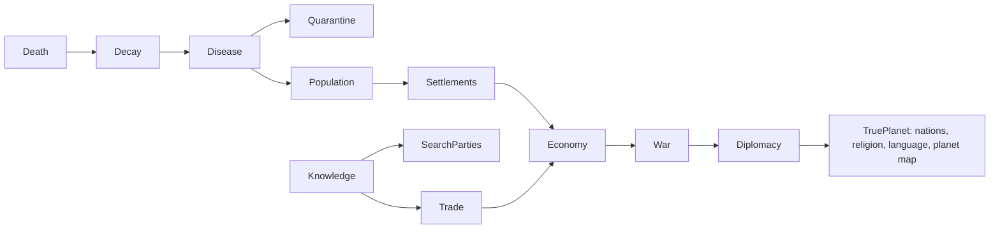

# Ruinarch+ — Design & Roadmap

*Expanded from `Features I want + Bugs I found.md`, grounded against the decompiled
source (`RuinarchRE/src/Assembly-CSharp`). Every "EXISTS" claim below cites a real
class. Difficulty tags: **S** (hours) · **M** (a day) · **L** (multi-day system) ·
**XL** (bigger than the base feature it touches).*

This is a proposal for you to approve / cut / reorder. Nothing is locked.

---

## 0. The core idea

**Ruinarch+** is one umbrella mod built on our ModLoader + Harmony. Two design laws:

1. **Wire what exists before building new.** The recon showed the game already has
   burial, graveyards, a full plague/transmission system, quarantine, farming, hunger,
   and migration — just *disconnected*. Most of your "features" are really **missing
   wires between systems the devs half-built**, which is exactly what a mod does well.
2. **Every phase ships on its own and feeds the next.** We never hold a working fix
   hostage to a giant system. Phase 1 is playable this week; each later phase snaps on.

The whole vision has one **realism spine** — each link is a system that already exists
or that we add, feeding the next:

Because the map is small and the base game is character-scale, the **civilization-scale**
end of your vision (planet map, nations, capitals, travel portals) is split into a
**separate sister mod, `TruePlanet`** (Phase 7). Ruinarch+ stays a "deepen what's here"
mod; TruePlanet is the "replace the world" mod. They're designed to stack.

---

## 1. Release ladder (overview)

| Phase | Name | Theme | Net difficulty | Ships |
|---|---|---|---|---|
| **1** | **Ruinarch+ Core** | Bugfixes + light QOL (Steam + your own) | **S–M** | now |
| **2** | **Death, Decay & Disease** | corpses rot, mass grave, corpse-borne plague, curfews | **M–L** | wires existing systems |
| **3** | **Knowledge & Fog of War** | villagers only know what they've seen; gossip; search parties; portal secrecy | **L** | new knowledge model |
| **4** | **Living Population** | birth, aging, natural death, dementia/knowledge-loss, migration rework | **L–XL** | mostly net-new |
| **5** | **Settlements & Economy** | growth tiers, food/hunters, famine & unrest, traders/messengers | **L–XL** | new progression + economy |
| **6** | **War & Diplomacy** | training grounds, standing armies, real wars, curfews/borders | **L** | extends warfare |
| **7** | **TruePlanet** (sister mod) | planet-scale world, nations & capitals, religion + language, travel portals | **XL** | separate mod |

---

## 2. PHASE 1 — Ruinarch+ Core  *(propose we build this first)*

Self-contained. Each fix is independently verifiable in-game. Split into **confirmed**
(source-verified, file:line) and **needs-repro** (found the code, want a live check first).

### 2a. Bugfixes — confirmed in source

| Fix | Symptom | Root cause (file:line) | Patch |
|---|---|---|---|
| **Tooltip debug leak** | Every trait tooltip (wells, chars…) shows dev text "Responsible Characters… / Is gained from stealth…" | `TraitItem.cs:24` appends `trait.GetTestingData()` | Transpile/postfix `TraitItem.OnHover` to drop the debug append |
| **Stalker brainwash dead-end** | You can queue Brainwash on a Stalker; it silently never works | `PrisonCell.IsValidBrainwashTarget:349-352` lacks the Stalker check that only exists in `WasBrainwashSuccessful:223` | Postfix `IsValidBrainwashTarget` → false for Stalker |
| **Paralyzed can't be schemed** | Paralyzed villagers can still leave faction/home but can't be targeted by schemes | `GoapPlanner.cs:156` exempts Paralyzed; `SchemeData.cs:81-96` doesn't | Mirror the exemption in `SchemeData` target validation |
| **Infinite chaos orbs** | Immortal monster (hibernating golem) in a Kennel → endless orbs | `BeingDrained.cs:47-51` broadcasts the orb **before** `AdjustHP`; immune target loses no HP | Postfix so the orb only drops if damage actually landed |

### 2b. Bugfixes — your own finds (source located, want a live repro to confirm the exact tint/branch)

| Fix | Your report | Where it lives | Fix hypothesis |
|---|---|---|---|
| **Portal placement / zoom** | Portal is red (can't place) zoomed out, green zoomed in — inconsistent | `AreaStructureComponent.CanBuildDemonicStructureHere:97-112`; `THE_PORTAL` is exempted from the `currentlyShowingLocation != null` gate at line 99 | The zoom state (`currentlyShowingLocation`) leaks into portal validity. Normalize so portal validity doesn't flip on zoom |
| **Released prisoner knows your portal** | Let-go prisoners path from your portal area and reveal it; should be knocked out & dropped near their own village by an imp | `LetGoData` → `MovementComponent.LetGo:788-817` teleports them to a random Wilderness tile *adjacent to the prison* (which sits in your base) | Relocate the drop to near their **home settlement** + apply Unconscious/Dazed; optionally spawn an imp carry-job for flavor |

### 2c. QOL

| Feature | Notes | Where |
|---|---|---|
| **Disable-tutorials toggle** | Add a Gameplay-settings switch that suppresses all tutorial alerts | `TutorialManager.cs:12-27` (14 alert types) + `SaveDataPlayer.cs:9-31` (no master flag today). Add a flag, gate alert spawn on it, add the UI row |

### 2d. Optional Phase-1 exploit fixes (say the word to include)
- **Flying-over-kennel Sacrifice/Let-Go** — `SacrificeData`/`LetGoData.ActivateAbility(LocationStructure)` bypasses the flying check in `IsValid`. Re-validate the target is actually *in* the kennel.
- **Snatch dropoff list empty** — `SnatchObjectUIController.ConstructDropLocationChoices:444-460` only lists *bookmarked* structures; add a sane fallback.

> **Proposed v1 = 2a + 2c + 2b.** All small, all verifiable, gives Ruinarch+ an honest
> "bugfix & QOL pack" first release. Exploits (2d) ship behind a config flag so purists
> can keep them.

---

## 3. PHASE 2 — Death, Decay & Disease

Your features 1, 1-2, 7. **Great news from recon: ~70% already exists, just unwired.**

**What EXISTS:**
- Corpses: `Tombstone.cs` (a dead Character wrapped as a TileObject).
- Burial: `BuryCharacter.cs` GOAP (`INTERACTION_TYPE.BURY_CHARACTER`) → `Cemetery.cs`
  (`STRUCTURE_TYPE.CEMETERY`), plus `AncientGraveyard.cs`.
- Disease: `PlagueDisease.cs` (singleton), `Plagued.cs` status (`IPlaguedListener`),
  `Plague/Transmission/Transmission.cs` (spreads via **Airborne / Consumption /
  Physical_Contact / Combat**; `Quarantined` trait cuts it 75%), `PlaguedEvent.cs`
  (ruler picks Do_Nothing / Quarantine / Slay / Exile).
- Quarantine: `Quarantine.cs` GOAP (`INTERACTION_TYPE.QUARANTINE`) → Hospice BedClinic +
  `CarePlagueBearersBehaviour.cs`.

**What's MISSING (the mod's job):**
1. **Corpse decomposition** — `Tombstone` has *no* rot timer. Add a per-tick decay
   counter (via `Signals.TICK_ENDED`, same pattern `Crops.cs` uses for ripening). Stages:
   fresh → bloated → rotting → skeletal → gone. **[M]**
2. **Mass Grave** — a demonic buildable structure that clears corpse-litter. **Delivered
   as a Ruinarch+ feature via the `Ruinarch.ModContent` framework** (NOT baked into the
   decompiled source — an earlier source-fork attempt was reverted; see
   `../ARCHITECTURE.md` §1–2). Ruinarch+ calls `ModContent.RegisterStructure(...)` in
   `OnLoad`, registering a virtual `STRUCTURE_TYPE` + `MassGrave : DemonicStructure` +
   `MassGraveData` build-skill against the **stock** game; the framework's factory prefixes
   make it buildable/saveable/menu-visible. Reuses the Crypt's prefab/visual + unlock.
   **Mechanism (source-verified):** the original "auto-issue `BuryCharacter` jobs" plan
   doesn't work — `BuryCharacter.GetTargetStructure` routes corpses to the *village*
   Cemetery, and villagers won't path into hostile demon territory to bury. Instead the pit
   runs a **passive hourly consume** (`Signals.HOUR_STARTED`): scans within 12 tiles, pulls
   unburied corpses in — sapient dead become tombstones *inside* the pit (reusing the game's
   `BuryCharacter.AfterBurySuccess` disposal: `SetGrave` + `DestroyMarker`), animals/monsters
   cleared. Skips carried / player-seized / already-being-buried corpses and villages with
   their own Cemetery. Fully try/catch-guarded. Tracks `bodyCount` + `fillRatio`
   (0–1, `MoundCapacity=30`). Consume logic preserved at `/tmp/massgrave-preserve/`, ready
   to port onto the framework. **Status:** framework-first; feature is the first consumer. **[M]**
3. **Corpse-borne disease** — feed rotting, *unburied* corpses into the existing
   `Transmission` system as an Airborne/Contact source scaled by corpse count & proximity.
   "3 corpses rotting in a village → outbreak fast," but not every stray body infects.
   This is the wire between Decay and the existing Plague system. **[M]**
4. **Settlement curfew / quarantine escalation** — today quarantine is per-character.
   Add a settlement-level `Curfew` event (extend `PlaguedEvent`) that keeps residents
   indoors and, later (Phase 6), closes borders. **[M–L]**
5. **Starvation death** — `CharacterNeedsComponent` has `STARVING≤20` but no death trigger
   (recon gap). Wire prolonged starvation → death; feeds famine in Phase 5. **[M]**

*Dependency:* unlocks the disease pressure that makes Phase 5's famine/unrest meaningful.

---

## 4. PHASE 3 — Knowledge & Fog of War

Your features 1-3, 5, and the *reason* your portal keeps getting found. This is the
conceptual keystone of your whole vision: **villagers should only know what they've
witnessed or been told.**

**Model (net-new, [L]):**
- A per-character/per-faction **knowledge ledger**: facts (a death, a missing person,
  the player's portal location, a blueprint, a trade price) each with a *source* and
  *confidence*.
- **Witnessing** writes facts (already partially there via the game's "aware
  characters"/investigation hooks — needs a focused recon of the existing
  awareness/`Rumor`/investigation code before we build, to avoid duplicating it).
- **Gossip & messengers** propagate facts between characters and settlements, lossily —
  you (the player) can *stir* or poison gossip.
- **Search parties** (today they beeline to your portal when someone's captured) instead
  search *last-known locations* and spread out; they only learn the portal by actually
  seeing it. This directly fixes your "they magically know where the portal is" complaint
  at the design level — and makes the Phase-2 released-prisoner fix consistent.

*Dependency:* feeds Trade (info = prices), War (scouting), and TruePlanet (inter-nation
knowledge). **Recon task before building: map the game's existing awareness/investigation
system so we extend rather than reinvent.**

---

## 5. PHASE 4 — Living Population

Your features 4, 5, 5-1. **Mostly net-new — the game has no life cycle.**

**What EXISTS:** relationships/lovers (hook for pairing); migration meter
(`SettlementVillageMigrationComponent`: cap 1500, +3–8/hr, 8% daily auto-event,
`StifleMigrationData` resets it). Reproduction exists only for Ratmen (`BirthRatman`).

**What's NEW:**
1. **Migration rework [M]** — gate the migration meter on settlement health (population,
   recent deaths, active war, food). A village crashing from 10→1 should *not* pull
   immigrants. Hook: Harmony the meter's hourly increment. *Shippable early, even before
   the rest of Phase 4.*
2. **Natural birth [L]** — couples procreate at a slow rate scaled by food/housing; babies
   → children → adults over game-years.
3. **Aging & natural death [L]** — age advances; elders sicken (dementia/alzheimer's as
   new flaws) and eventually die of old age. Dementia ties to Phase 3: they **forget**
   ledger facts, so knowledge decays with generations.
4. **Library [M–L]** — a structure that *persists* faction knowledge against that decay
   (Phase 3 ledger + Phase 4 aging). Villagers deposit what they learn on return from
   searches/trades; burning it is a real strategic blow.

*Dependency:* population + food + war together drive Phase 5 settlement growth.

---

## 6. PHASE 5 — Settlements & Economy

Your features 1-4, 10 (growth half), 11.

**What EXISTS:** `LOCATION_TYPE` is **static** (`VILLAGE`, etc.) — *no tiers*. Farming is
real: `Farm.cs`, `Crops.cs`, `FoodPile.cs`, `CharacterNeedsComponent` hunger.

**What's NEW:**
1. **Settlement progression [L]** — `Outpost → Village → Town → City` driven by
   population + buildings-in-use, with demotion when they collapse (hysteresis so one bad
   week doesn't flip it). Capital is defined in TruePlanet.
2. **Food economy & famine [M–L]** — add **hunters** (the game lacks them), tie food
   supply → the existing hunger need → (Phase 2) starvation → **famine, unrest, political
   unrest** events. Sabotaging a food source becomes a real lever for you.
3. **Traders & messengers [L]** — caravans run between settlements; carry goods *and*
   facts (Phase 3). No trade between factions at war (Phase 6). This is the seed of your
   "TruePlanet kingdoms" economy.

---

## 7. PHASE 6 — War & Diplomacy

Your feature 10 (military half), plus curfews/borders from Phase 2.

**What EXISTS:** a warfare mechanic, but short-lived (partly because populations are tiny —
Phases 4–5 fix the root cause).

**What's NEW:**
- **Training grounds [M]** in Town+ settlements → local standing armies (melee/archer/…).
- **Patrols & levies [L]** — locals patrol and kill threats; a nation at war can call them
  up; they march off-region, and win/lose/die (feeding Phase 4 population).
- **Curfews & closed borders [M]** — the settlement-curfew from Phase 2 escalates to
  kingdom-level border closure during war/plague.
- **Diplomacy [L]** — alliances, territory trade, war declarations you can scheme into.

---

## 8. PHASE 7 — TruePlanet  *(separate sister mod, XL)*

Your features 8, 9, 9-1. This is a **world-generation replacement**, correctly its own mod:

- **Planet generation** — continents, oceans, mountains, frozen lands, biomes; regions
  owned by **nations** with a **capital**. A region = one connected map, **bigger than
  "Very Large."**
- **Settlement hierarchy** — `Outpost → Village → Town → City → Capital` (capital unique
  per nation, special buildings: Palace/Parliament/etc. by government type).
- **Region preview** — inspect a region before committing your portal (avoid dropping into
  a packed capital with nowhere to build).
- **Two portal types** — **Main Portal** (current) + **Travel Portal**: linked network;
  demons spawned far away route home through the nearest travel portal (smart pathing, no
  manual hopping). Enables spreading your operation across regions.
- **Religion & language** — every nation has its own; a region can diverge from its nation
  (conquest, territory trade). Feeds diplomacy (Phase 6) and gossip/knowledge (Phase 3:
  language barriers throttle information spread).

TruePlanet depends on Ruinarch+ Phases 3–6 being in place to feel alive; we build it last.

---

## 9. Open recon before we commit to a phase

- **Phase 3:** map the existing awareness / investigation / rumor system (do villagers
  already have any "known info" model?). Decides whether fog-of-war is an *extension* or a
  *from-scratch* build.
- **Phase 2 portal bug & released-prisoner:** one live repro each to confirm the exact
  branch/tint before patching.
- **Phase 5 settlement tiers:** confirm nothing in `NPCSettlement` already tracks a
  soft "size" we can lean on.

---

## 10. Naming & packaging

- Display name **Ruinarch+**; mod id `ruinarch.plus` (namespace `RuinarchPlus`, since `+`
  isn't file-safe). Sister mod: **TruePlanet** (`trueplanet`).
- Ships via our ModLoader (drop in `Mods/`, no external injector). Phase 1 releases as
  `Ruinarch+ v0.1`; later phases bump minor versions or ship as optional add-on modules
  behind config flags so players can pick their depth.
