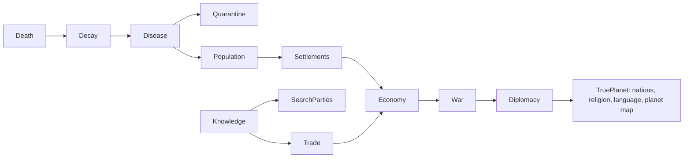

# Ruinarch+: Design & Roadmap

*A phased design for the Ruinarch+ mod, checked against the decompiled
source (`RuinarchRE/src/Assembly-CSharp`). Every "EXISTS" claim below cites a real
class. Difficulty tags: **S** (hours), **M** (a day), **L** (multi-day system),
**XL** (bigger than the base feature it touches).*

The later phases are plans, not commitments; they may be cut or reordered.

---

## 0. The core idea

**Ruinarch+** is one umbrella mod built on the ModLoader + Harmony. Two design laws:

1. **Connect what exists before building new.** The game already has burial,
   graveyards, a full plague and transmission system, quarantine, farming, hunger and
   migration, but they barely interact. Many of the target features are connections
   between those systems.
2. **Every phase ships on its own and feeds the next.** No finished fix waits on a
   large system.

The whole vision has one **realism spine**: each link is a system that already exists
or that the mod adds, feeding the next:

Because the map is small and the base game is character-scale, the **civilization-scale**
end of the vision (planet map, nations, capitals, travel portals) is split into a
**separate sister mod, `TruePlanet`** (Phase 7). Ruinarch+ stays a "deepen what's here"
mod; TruePlanet is the "replace the world" mod. They're designed to stack.

---

## 1. Release ladder (overview)

| Phase | Name | Theme | Net difficulty | Ships |
|---|---|---|---|---|
| **1** | **Ruinarch+ Core** | Bugfixes + light QOL | **S to M** | shipped |
| **2** | **Death, Decay & Disease** | corpses rot, mass grave, corpse-borne plague, curfews | **M to L** | wires existing systems |
| **3** | **Knowledge & Fog of War** | villagers only know what they've seen; gossip; search parties; portal secrecy | **L** | new knowledge model |
| **4** | **Living Population** | birth, aging, natural death, dementia/knowledge-loss, migration rework | **L to XL** | mostly net-new |
| **5** | **Settlements & Economy** | growth tiers (shipped: Town Hall, Town, City), food/hunters, famine & unrest, traders/messengers | **L to XL** | new progression + economy |
| **6** | **War & Diplomacy** | training grounds, standing armies, real wars, curfews/borders | **L** | extends warfare |
| **7** | **TruePlanet** (sister mod) | planet-scale world, nations & capitals, religion + language, travel portals | **XL** | separate mod |

---

## 2. PHASE 1: Ruinarch+ Core

Self-contained. Each fix is independently verifiable in-game. All of Phase 1 below
(2a to 2c) has shipped.

### 2a. Bugfixes: confirmed in source

| Fix | Symptom | Root cause (file:line) | Patch |
|---|---|---|---|
| **Tooltip debug leak** | Every trait tooltip (wells, chars...) shows dev text "Responsible Characters... / Is gained from stealth..." | `TraitItem.cs:24` appends `trait.GetTestingData()` | Transpile/postfix `TraitItem.OnHover` to drop the debug append |
| **Stalker brainwash dead-end** | Brainwash can be queued on a Stalker; it silently never works | `PrisonCell.IsValidBrainwashTarget:349-352` lacks the Stalker check that only exists in `WasBrainwashSuccessful:223` | Postfix `IsValidBrainwashTarget` returns false for Stalker |
| **Paralyzed can't be schemed** | Paralyzed villagers can still leave faction/home but can't be targeted by schemes | `GoapPlanner.cs:156` exempts Paralyzed; `SchemeData.cs:81-96` doesn't | Mirror the exemption in `SchemeData` target validation |
| **Infinite chaos orbs** | Immortal monster (hibernating golem) in a Kennel produces endless orbs | `BeingDrained.cs:47-51` broadcasts the orb **before** `AdjustHP`; immune target loses no HP | Postfix so the orb only drops if damage actually landed |

### 2b. Bugfixes: confirmed with a live repro

| Fix | Report | Root cause | Patch |
|---|---|---|---|
| **Portal placement behind the banner** | The Portal cannot be placed on tiles that sit behind the "Pick a tile to place your portal" banner | Placement is gated on `UIManager.IsMouseOnUI()`, a UI raycast; the banner (`InitialWorldSetupMenu.pickPortalMessage`) is a UI element in the middle of the screen, so it swallows the raycast | A `CanvasGroup` with `blocksRaycasts = false` on the banner; it still shows (`Fix_PortalPlacementBehindBanner.cs`) |
| **Released prisoner knows the portal** | Let-go prisoners walk out of the demon base and report the Portal | `LetGoData` -> `MovementComponent.LetGo:788-817` drops them on a Wilderness tile *next to the prison*, inside the demon base | Knock them Unconscious and move them to their home structure (`Fix_ReleasedPrisonerRevealsPortal.cs`) |

### 2c. QOL

| Feature | Notes | Where |
|---|---|---|
| **Disable-tutorials toggle** | Suppresses all tutorial alerts; shipped as the `disableTutorial` config flag rather than a settings row | `TutorialManager.cs:12-27` (14 alert types) + `SaveDataPlayer.cs:9-31` (no master flag in the game) |

### 2d. Possible exploit fixes (not shipped)
- **Flying-over-kennel Sacrifice/Let-Go:** `SacrificeData`/`LetGoData.ActivateAbility(LocationStructure)` bypasses the flying check in `IsValid`. Re-validate the target is actually *in* the kennel.
- **Snatch dropoff list empty:** `SnatchObjectUIController.ConstructDropLocationChoices:444-460` only lists *bookmarked* structures; add a sane fallback.

If these ship, they go behind a config flag so players who like the exploits can keep them.

---

## 3. PHASE 2: Death, Decay & Disease

**Most of the pieces already exist in the game; they are not connected.**

**What EXISTS:**
- Corpses: a dead `Character` keeps its map marker and lies where it fell. A `Tombstone`
  (`Tombstone.cs`) is the **grave**: the game creates one only when a villager buries the
  body (`BuryCharacter.AfterBurySuccess`, the sole creation site).
- Burial: `BuryCharacter.cs` GOAP (`INTERACTION_TYPE.BURY_CHARACTER`) -> `Cemetery.cs`
  (`STRUCTURE_TYPE.CEMETERY`), plus `AncientGraveyard.cs`.
- Disease: `PlagueDisease.cs` (singleton), `Plagued.cs` status (`IPlaguedListener`),
  `Plague/Transmission/Transmission.cs` (spreads via **Airborne / Consumption /
  Physical_Contact / Combat**; `Quarantined` trait cuts it 75%), `PlaguedEvent.cs`
  (ruler picks Do_Nothing / Quarantine / Slay / Exile).
- Quarantine: `Quarantine.cs` GOAP (`INTERACTION_TYPE.QUARANTINE`) -> Hospice BedClinic +
  `CarePlagueBearersBehaviour.cs`.
- Starvation death: already in the base game (the Malnourished status); no mod feature needed.

**What's SHIPPED (Phase 2 so far).** Items marked *verified* pass the automated in-game test
harness (`RuinarchDebug/AutoTest.cs`, run with the loader's `tools/run-autotest.sh`), which
starts a real world and plays the scenario out at speed.
1. **Corpse decomposition** - `Phase2/CorpseDecay.cs`: unburied bodies (dead, marker still
   on the map, no grave) rot Fresh -> Bloated -> Rotting -> Skeletal, then the remains are
   gone. Anything buried never rots; a carried body pauses. Found by an hourly region scan, so
   loaded saves and every death path are covered. *(verified: stages at 18/36/54 h, gone at
   72 h with the default 3 days)*. An earlier version keyed on `Tombstone`s and so rotted
   **graves** outside cemeteries instead of bodies; replaced.
2. **Corpse-borne disease** - `Phase2/CorpseDisease.cs`: rotting/skeletal *unburied* bodies
   inside a settlement structure feed the existing plague, scaled by corpse count. Buried
   bodies are never infectious. On by default (0.5.0; was opt-in).
3. **Mass Grave** - a non-demonic **village building** (`MassGrave : ManMadeStructure`,
   mirroring `Cemetery`), new content via `Ruinarch.ModContent` (`IsVillageStructure`),
   borrowing the Cemetery prefab. Destructible like any village building.
   - **Villagers build it from materials** (`MassGraveConstruction.cs`): a village with a body
     lying in it and no Cemetery / Cult Temple / Mass Grave queues a vanilla `PLACE_BLUEPRINT`
     job; villagers place it, haul the stone/wood its `craftCost` needs, and build it. The
     finished type comes from the prefab (`GenericTileObject.BuildBlueprint`), so the Cemetery
     prefab's CEMETERY is swapped for the Mass Grave type only while a remembered Mass Grave
     blueprint is being built (pooled prefabs are never mutated). *(verified: built after 51 h)*
   - **Burial reroute** (`MassGraveBurial.cs`): both vanilla scatter paths are covered, the
     settlement job (`TriggerBuryMe`) and the personal job a villager queues on seeing a body
     outside village tiles (`TriggerPersonalOutsideVillageBuryJob`). A village with a
     Cemetery / Cult Temple buries its people exactly as vanilla; one without leaves bodies
     where they fell until it has a Mass Grave, then villagers carry every body into it.
     *(verified: no wilderness grave; resident and pre-existing corpses hauled into the pit;
     Cemetery village still uses its Cemetery)*
   - **Creature disposal**: animal and monster carcasses in the village become bury jobs to
     the pit and are disposed (no tombstone), even in a village that also has a Cemetery.
     *(verified)*
   - **Fallback**: a body near the pit that nobody hauls for `massGraveFallbackHours` (12,
     e.g. the village is dead) is absorbed directly.
   - The "this blueprint is a Mass Grave" mark is saved (`ModBuildings.cs`,
     `ModData/ruinarch.plus.blueprints.json`), so a pit saved half-built still completes as a
     Mass Grave after reload. The construction machinery is shared by every Ruinarch+
     building (Mass Grave, Town Hall).
   - **Look** (`MassGraveFloor.cs`): bare dirt, no art of its own. Like every building in
     the game it is a floor with walls and objects on top; the pit keeps the Cemetery's
     footprint and walls, and its floor is set to the prefab's own dirt tile on build and
     load (the Cemetery's paved cross removed). An earlier sprite overlay (a test of the
     framework's `ModArt`) was removed in 0.5.0. The Cemetery prefab's props
     (BRAZIER, PLINTH_BOOK, GODDESS_STATUE, WATER_BASIN, TRASH) are not built on a Mass Grave
     (prefix `LocationStructureObject.OnBuiltStructureObjectPlaced`) and are cleared from pits
     saved before this; its STRUCTURE_TILE_OBJECT is kept (removing it made the pit count as
     not standing). *(verified: one dirt ground tile over the pit, no props)*
   - **Anonymous burial:** a body laid in the pit (hauled or absorbed) leaves no Tombstone;
     it is removed like a fully decomposed body (`Tombstone.SetRespawnCorpseOnDestroy(false)`
     + `RemovePOI`), and older pits have their gravestones cleared once per session. Only the
     pit's count remains (`bodyCount`, not saved).
   - **Surroundings:** hourly, the pit also queues BURY jobs for bodies in the ring of map
     areas around the village (`MassGrave.CatchmentAreas`): creatures, outsiders, and the
     village's own dead when it has no Cemetery. Bodies are found through the region's
     character list; an area's own list only gains a character when its marker moves
     between areas, so a body that never moved is missing from it.
   - **Who goes where:** a village's own people (`homeSettlement` / `homeSettlementOnDeath`)
     go to its Cemetery / Cult Temple when it has one; outsiders, monsters and creatures go
     to the Mass Grave (to the Cemetery only if there is no pit). At most one Mass Grave per
     village, enforced for villager construction and for the debug/instant build.
4. **Settlement curfew** (`Curfew.cs`): a ruler who answers a plague outbreak
   (`PlaguedEvent`) with a measured response, Quarantine or Exile, also puts the village under
   curfew until the event ends. Residents give up free time (visiting, taverns, wandering) and
   go home; work continues, since work is how the settlement's jobs (plague care, burials,
   food) get done; the ruler and faction leader are exempt; needs and combat are untouched.
   Enforced at `BehaviourComponent.RunBehaviour` (return home, else stay in). Deliberately
   **not** a new `PLAGUE_EVENT_RESPONSE`: `ExecuteEffectsOfLeaderResponseToPlague` throws on
   unknown values and the decision is saved and localized. The curfew is derived (active
   event + measured decision), so nothing is saved. Announced in the event log.

**What's NEXT for Phase 2:**
5. **Closed borders [M]:** extend the curfew so a village under curfew turns away visitors
   and traders (ties into Phase 5 traders and Phase 6 border closure).

*Dependency:* unlocks the disease pressure that makes Phase 5's famine/unrest meaningful.

---

## 4. PHASE 3: Knowledge & Fog of War

This is the conceptual keystone of the whole vision: **villagers should only know what they've
witnessed or been told.** It also addresses why the portal keeps getting found.

**What EXISTS (cited against `RuinarchRE`):**
- **Gossip about deeds, not places.** Each character keeps a pool of up to 40 witnessed or
  informed actions (`RumorComponent.AddAssumedWitnessedOrInformedNegativeInfo`,
  `RumorComponent.cs:57-79`, fed by `ReactionComponent.cs:120,150`). The transport is the
  `SHARE_INFORMATION` GOAP action (`ShareInformation.cs`), queued as share-negative-info,
  spread-rumor and confirm-rumor jobs (`CharacterJobTriggerComponent.cs:2001-2051`). Rumors
  are made up by characters who hate someone (`BaseRelationshipContainer.cs:1421`) and by the
  player's Spread Rumor skill (`SpreadRumorData.cs:145`); `Assumption`/`AssumptionComponent`
  hold guesses. All of it is about *what a character did* (crimes, affairs), never *where
  something is*.
- `LocationAwareness` (`Area.cs:81`, `LocationStructure.cs:157`) is a per-location index of
  objects by action type used by the planner. It is not character memory.
- **Portal discovery is one faction-wide switch.** A villager who sees a demonic structure
  (`CharacterTrait.cs:202-223`) queues a report if their faction is not yet aware; the report
  (`ReportCorruptedStructure.AfterReportSuccess`, `ReportCorruptedStructure.cs:81-93`) adds the
  structure to `InnerMapManager.worldKnownDemonicStructures`, raises threat, and calls
  `Faction.SetIsAwareOfPlayer(true)` (a saved bool, `SaveDataFaction.cs:79`). If already
  aware, the sighting rolls `CHANCE_TYPE.Counterattack` instead. A village whose area borders
  the player's also becomes aware and counterattacks with no sighting at all
  (`SettlementPartyComponent.cs:349-379`).
- **The leak:** `worldKnownDemonicStructures` is written but never read, and not saved. The
  counterattack's destination is the **whole player settlement**
  (`CounterattackPartyQuest.cs:10,57-60`), so seeing one structure reveals all of them,
  the portal included.
- **Rescue is omniscient.** Every party-processing pass rolls 50% (100% with 2+ parties) to
  rescue any resident who is Restrained/Paralyzed outside the village
  (`SettlementPartyComponent.cs:236-251`, `BaseSettlement.GetRandomResidentForRescue`
  `BaseSettlement.cs:397-415`), with no witness needed, and the party goes to the captive's
  **live** location (`RescuePartyQuest.GetTargetDestination`, `RescuePartyQuest.cs:31-42`).
  Witness-driven rescues also exist (`Abduct.cs:124-126`, `Distraught.cs:27-29`,
  `IsCaptive.cs:301-303`).
- There is **no missing-person state** anywhere in the game.

**Model ([L], extends the above rather than replacing it):**
- **Shipped: per-faction known-structures ledger** (`Phase3/Knowledge.cs`, config
  `knowledgeEnabled`). Fed by the game's own report (`AfterReportSuccess`), by sightings once
  the faction is aware of the player (prefix `CharacterTrait.OnSeePOI`), and by adjacency
  (postfix `SettlementPartyComponent.TryCreateCounterattackQuest`). Saved inside the player's
  save through the loader's new `ModSave` (`ModData/ruinarch.plus.knowledge.json`).
- **Shipped: counterattacks go only where the faction knows:** postfix
  `CounterattackPartyQuest.GetTargetDestination` returns the nearest known structure, and a
  prefix on `AttackDemonicStructureBehaviour.TryDoBehaviour` attacks known structures instead
  of the hard-coded portal; with nothing known left standing, the quest ends as a success. A
  faction that is aware but knows nothing (older saves) keeps vanilla behaviour.
- **Shipped: rescues and bounty hunts ask the ledger too** (`Phase3/KnowledgeTargets.cs`).
  The game decides three more things about one player building with the faction-wide
  `isAwareOfPlayer`: a Demon Rescue for a villager held inside it
  (`PartyQuestBoard.CreateRescuePartyQuest`), a bounty hunt on a criminal hiding in it
  (`CreateBountyHuntPartyQuest`, reached from `TryCreateBountyHuntQuest`), and attacking it on
  arrival (`RescueBehaviour` / `BountyHuntBehaviour.TryDoBehaviour`). Each now requires the
  faction to know that building; unknown, the village searches for the demonic area (the
  unaware branch). A party that sees its target inside learns the building. Not faction
  knowledge, left as is: a dragon picks any player building (`Dragon.SetPlayerTargetStructure`)
  and Divine Intervention targets the Portal.
- **Shipped: missing persons and searches by last-known location**
  (`Phase3/MissingPersons.cs`, `Phase3/MissingPersonsSearch.cs`, config
  `missingPersonsEnabled`). Each resident's last sighting by their own people (home village,
  or in sight of a free faction member) is kept hourly; unseen for a day, they are reported
  missing and the village posts the game's own rescue quest, pointed at the last-seen spot,
  where the party sweeps until it sees them or gives up (retried after 24 then 48 hours,
  three attempts). The omniscient settlement rescue roll is off. Records ride in the save
  through `ModSave` (`ModData/ruinarch.plus.missing.json`). Spec:
  `docs/specs/2026-09-23-missing-persons-design.md`.
- **Gossip carries places:** reuse `SHARE_INFORMATION` to pass ledger facts between
  villagers, lossily, so a report can spread faster than a messenger walks.

*Dependency:* feeds Trade (info = prices), War (scouting), and TruePlanet (inter-nation
knowledge).

---

## 5. PHASE 4: Living Population

**Mostly net-new: the game has no life cycle.**

**What EXISTS:** relationships/lovers (hook for pairing); migration meter
(`SettlementVillageMigrationComponent`: cap 1500, +3 to 8/hr, 8% daily auto-event,
`StifleMigrationData` resets it). Reproduction exists only for Ratmen (`BirthRatman`).

**What's NEW:**
1. **Migration rework [M]: shipped** (`Phase4/MigrationHealth.cs`, config
   `migrationHealthEnabled`). Every natural gain funnels through
   `SettlementVillageMigrationComponent.IncreaseVillageMigrationMeter`; a prefix scales it by
   village health: 0 during plague (`isPlagued` or an active Plagued event) or siege, 0 when abandoned homes (beyond
   2 spare) outnumber occupied ones, else halved per abandoned home beyond the 2 the build planner keeps spare, halved per unburied body on
   village tiles. A postfix on `Character.Death` takes 150/1500 off the home village's meter.
   The meter tooltip explains the throttle. Induce Migration bypasses the meter and is
   unaffected. In vanilla the only gate is `residents.Count > 0`; wave size scales with
   the player's portal level (`SettlementVillageMigrationComponent.cs:337-355`).
2. **Natural birth [L]:** couples procreate at a slow rate scaled by food/housing; babies
   become children then adults over game-years.
3. **Aging & natural death [L]:** age advances; elders sicken (dementia/alzheimer's as
   new flaws) and eventually die of old age. Dementia ties to Phase 3: they **forget**
   ledger facts, so knowledge decays with generations.
4. **Library [M to L]:** a structure that *persists* faction knowledge against that decay
   (Phase 3 ledger + Phase 4 aging). Villagers deposit what they learn on return from
   searches/trades; burning it is a real strategic blow.

*Dependency:* population + food + war together drive Phase 5 settlement growth.

---

## 6. PHASE 5: Settlements & Economy

**What EXISTS (cited against `RuinarchRE`):**
- **No size tiers.** `SettlementType` (`Settlement_Types/SettlementType.cs`) is a culture
  flavour (`Human_Village`, `Elven_Hamlet`, `Capital`, `Cult_Town`...), set at founding
  (`NPCSettlement.SetSettlementType`, `NPCSettlement.cs:2339-2346`) and never changed by growth.
  Its caps are hard-coded constants, re-set on load rather than saved: `maxDwellings` 16 / 24
  (Capital) / 10 (Cult Town), `maxFacilities` 12 to 16 (`HumanVillage.cs:10-18` etc.). They
  are read in exactly two places: the build planner (`SettlementJobTriggerComponent.cs:1032,
  1041,1065`) and per-facility caps (`NPCSettlement.cs:1198`). `VILLAGE_SIZE`
  (Small/Medium/Large, `VillageSetting.cs`) only shapes world generation. `LOCATION_TYPE` is
  static.
- **Food is piles, not a stockpile.** There is no settlement food counter; totals are summed
  from `FoodPile`s on demand (`BaseSettlement.GetNumberOfFoodInWholeSettlement`,
  `BaseSettlement.cs:1328`). Producers are Farmer, Fisher and Butcher
  (`Extensions.IsFoodProducerClassName`, `Extensions.cs:1700-1707`). `PRODUCE_FOOD` jobs fire
  below a minimum (`ProduceResourceApplicabilityChecker.cs:23,43`). The build planner already
  compares residents with potential food capacity and builds a Butcher's Shop, Fishery or Farm
  when short (`SettlementJobTriggerComponent.cs:1098-1104`,
  `SettlementResourcesComponent.cs:14-38`). Hunger is per character: Hungry -> Starving, plus
  Malnourished (`CharacterNeedsComponent.cs:1236-1355`). There is **no settlement-level
  shortage signal**.
- **Hunting:** "Hunter" is a *combatant* class (`HumanEmpire.cs` and the other faction
  types), not a food producer. The Hunter Lodge employs a Skinner
  (`SettlementClassComponent.cs:605-608`); `HuntBeastPartyQuest` exists (bandits use it,
  `SettlementPartyComponent.cs:314`).
- **No trade.** "Merchant" is just the Tavern's worker class
  (`SettlementClassComponent.cs:611-614`). Nothing moves goods between settlements; there
  are no caravans or trade routes.

**What's NEW:**
1. **Settlement progression: shipped** (`Phase5/SettlementTiers.cs`, `Phase5/TownHall.cs`,
   config `settlementTiersEnabled`, `townPopulation` 20, `cityPopulation` 40).
   `Village -> Town -> City`. A village of `townPopulation` living villagers queues a
   **Town Hall** blueprint (a new village building through `Ruinarch.ModContent`, borrowing
   the Tavern's prefab; no art of its own) and its villagers build it through the game's
   own pipeline, so it is damaged and destroyed like any building. While it stands the
   village is a Town, a City from `cityPopulation`; a tier is kept down to 3/4 of its mark
   (hysteresis) and lost the moment the Town Hall is destroyed. A tier raises the two
   limits the build planner reads (set through reflection hourly and on load; the culture's
   own values are the base): Town +8 dwellings / +4 facilities, City +16 / +8. No new
   `SETTLEMENT_TYPE` (it is saved and drives culture-specific facility weights). The tier
   is saved (`ModData/ruinarch.plus.tiers.json`), announced in the event log, and named in
   the settlement panel ("Human Empire Town"). Outpost (a tier *below* a vanilla village)
   is left out: it would shrink villages the game generates. Capital is TruePlanet's.
2. **Food economy & famine [M to L]:** *Famine shipped* (`Phase5/Famine.cs`, config
   `famineEnabled`, `famineHours` 12, `famineLeaveChance` 25). The signal is the game's own
   hunger rather than food piles (consumption rates are runtime-only editor values): a third
   of a village's villagers Starving or Malnourished for `famineHours` -> famine, until a
   tenth or fewer for as long. Announced; no migration (`MigrationHealth` reason "famine");
   once a day each starving villager (not ruler / faction leader) may move, via the game's
   own `Character.MigrateHomeStructureTo`, to a free Dwelling in a village of their faction
   not in famine. Active famines are saved (`ModData/ruinarch.plus.famine.json`).
   *Still to do:* unrest and political unrest (ruler challenged) from a long famine.
   Food-producing hunters are optional (Butchers already turn carcasses into food). Sabotaging a food
   source becomes a real lever for the player.
3. **Traders & messengers [L]:** entirely new. Caravans run between settlements, moving
   piles and carrying facts (Phase 3). No trade between factions at war (Phase 6). This is
   the seed of the "TruePlanet kingdoms" economy.

---

## 7. PHASE 6: War & Diplomacy

Military systems, plus curfews/borders from Phase 2.

**What EXISTS:** a warfare mechanic, but short-lived (partly because populations are tiny,
which Phases 4 and 5 fix at the root).

**What's NEW:**
- **Training grounds [M]** in Town+ settlements produce local standing armies (melee/archer/...).
- **Patrols & levies [L]:** locals patrol and kill threats; a nation at war can call them
  up; they march off-region, and win/lose/die (feeding Phase 4 population).
- **Curfews & closed borders [M]:** the settlement-curfew from Phase 2 escalates to
  kingdom-level border closure during war/plague.
- **Diplomacy [L]:** alliances, territory trade, war declarations the player can scheme into.

---

## 8. PHASE 7: TruePlanet  *(separate sister mod, XL)*

This is a **world-generation replacement**, correctly its own mod:

- **Planet generation:** continents, oceans, mountains, frozen lands, biomes; regions
  owned by **nations** with a **capital**. A region = one connected map, **bigger than
  "Very Large."**
- **Settlement hierarchy:** `Outpost -> Village -> Town -> City -> Capital` (capital unique
  per nation, special buildings: Palace/Parliament/etc. by government type).
- **Region preview:** inspect a region before committing the portal (avoid dropping into
  a packed capital with nowhere to build).
- **Two portal types:** **Main Portal** (current) + **Travel Portal**: linked network;
  demons spawned far away route home through the nearest travel portal (smart pathing, no
  manual hopping). Enables spreading the operation across regions.
- **Religion & language:** every nation has its own; a region can diverge from its nation
  (conquest, territory trade). Feeds diplomacy (Phase 6) and gossip/knowledge (Phase 3:
  language barriers throttle information spread).

TruePlanet depends on Ruinarch+ Phases 3 to 6 being in place to feel alive; it ships last.

---

## 9. Naming & packaging

- Display name **Ruinarch+**; mod id `ruinarch.plus` (namespace `RuinarchPlus`, since `+`
  isn't file-safe). Sister mod: **TruePlanet** (`trueplanet`).
- Ships via the ModLoader (drop in `Mods/`, no external injector). Phase 1 shipped as
  `v0.1`; later phases bump the minor version, with a config flag per feature so players
  can pick their depth.
