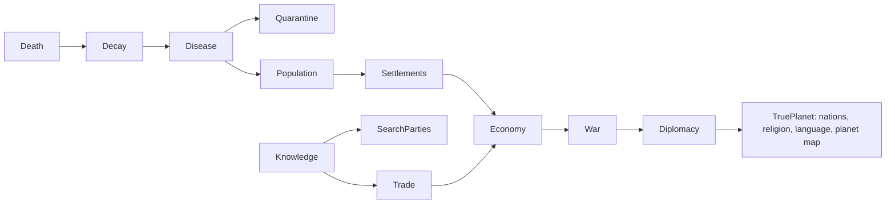

# Ruinarch+: Design & Roadmap

*A phased design for the Ruinarch+ mod, grounded against the decompiled
source (`RuinarchRE/src/Assembly-CSharp`). Every "EXISTS" claim below cites a real
class. Difficulty tags: **S** (hours), **M** (a day), **L** (multi-day system),
**XL** (bigger than the base feature it touches).*

This roadmap is a proposal open to approval, cutting, or reordering. Nothing is locked.

---

## 0. The core idea

**Ruinarch+** is one umbrella mod built on the ModLoader + Harmony. Two design laws:

1. **Wire what exists before building new.** The recon showed the game already has
   burial, graveyards, a full plague/transmission system, quarantine, farming, hunger,
   and migration, just *disconnected*. Most of the target features are really **missing
   wires between systems the devs half-built**, which is exactly what a mod does well.
2. **Every phase ships on its own and feeds the next.** No working fix is held
   hostage to a giant system. Phase 1 is playable this week; each later phase snaps on.

The whole vision has one **realism spine**: each link is a system that already exists
or that the mod adds, feeding the next:

Because the map is small and the base game is character-scale, the **civilization-scale**
end of the vision (planet map, nations, capitals, travel portals) is split into a
**separate sister mod, `TruePlanet`** (Phase 7). Ruinarch+ stays a "deepen what's here"
mod; TruePlanet is the "replace the world" mod. They're designed to stack.

---

## 1. Release ladder (overview)

| Phase | Name | Theme | Net difficulty | Ships |
|---|---|---|---|---|
| **1** | **Ruinarch+ Core** | Bugfixes + light QOL | **S to M** | now |
| **2** | **Death, Decay & Disease** | corpses rot, mass grave, corpse-borne plague, curfews | **M to L** | wires existing systems |
| **3** | **Knowledge & Fog of War** | villagers only know what they've seen; gossip; search parties; portal secrecy | **L** | new knowledge model |
| **4** | **Living Population** | birth, aging, natural death, dementia/knowledge-loss, migration rework | **L to XL** | mostly net-new |
| **5** | **Settlements & Economy** | growth tiers, food/hunters, famine & unrest, traders/messengers | **L to XL** | new progression + economy |
| **6** | **War & Diplomacy** | training grounds, standing armies, real wars, curfews/borders | **L** | extends warfare |
| **7** | **TruePlanet** (sister mod) | planet-scale world, nations & capitals, religion + language, travel portals | **XL** | separate mod |

---

## 2. PHASE 1: Ruinarch+ Core

Self-contained. Each fix is independently verifiable in-game. Split into **confirmed**
(source-verified, file:line) and **needs-repro** (code located, wants a live check first).

### 2a. Bugfixes: confirmed in source

| Fix | Symptom | Root cause (file:line) | Patch |
|---|---|---|---|
| **Tooltip debug leak** | Every trait tooltip (wells, chars...) shows dev text "Responsible Characters... / Is gained from stealth..." | `TraitItem.cs:24` appends `trait.GetTestingData()` | Transpile/postfix `TraitItem.OnHover` to drop the debug append |
| **Stalker brainwash dead-end** | Brainwash can be queued on a Stalker; it silently never works | `PrisonCell.IsValidBrainwashTarget:349-352` lacks the Stalker check that only exists in `WasBrainwashSuccessful:223` | Postfix `IsValidBrainwashTarget` returns false for Stalker |
| **Paralyzed can't be schemed** | Paralyzed villagers can still leave faction/home but can't be targeted by schemes | `GoapPlanner.cs:156` exempts Paralyzed; `SchemeData.cs:81-96` doesn't | Mirror the exemption in `SchemeData` target validation |
| **Infinite chaos orbs** | Immortal monster (hibernating golem) in a Kennel produces endless orbs | `BeingDrained.cs:47-51` broadcasts the orb **before** `AdjustHP`; immune target loses no HP | Postfix so the orb only drops if damage actually landed |

### 2b. Bugfixes: located in source, want a live repro to confirm the exact tint/branch

| Fix | Report | Where it lives | Fix hypothesis |
|---|---|---|---|
| **Portal placement / zoom** | Portal is red (can't place) zoomed out, green zoomed in, inconsistent | `AreaStructureComponent.CanBuildDemonicStructureHere:97-112`; `THE_PORTAL` is exempted from the `currentlyShowingLocation != null` gate at line 99 | The zoom state (`currentlyShowingLocation`) leaks into portal validity. Normalize so portal validity doesn't flip on zoom |
| **Released prisoner knows the portal** | Let-go prisoners path from the portal area and reveal it; should be knocked out & dropped near their own village by an imp | `LetGoData` -> `MovementComponent.LetGo:788-817` teleports them to a random Wilderness tile *adjacent to the prison* (which sits in the demon base) | Relocate the drop to near their **home settlement** + apply Unconscious/Dazed; optionally spawn an imp carry-job for flavor |

### 2c. QOL

| Feature | Notes | Where |
|---|---|---|
| **Disable-tutorials toggle** | Add a Gameplay-settings switch that suppresses all tutorial alerts | `TutorialManager.cs:12-27` (14 alert types) + `SaveDataPlayer.cs:9-31` (no master flag today). Add a flag, gate alert spawn on it, add the UI row |

### 2d. Optional Phase-1 exploit fixes (include on request)
- **Flying-over-kennel Sacrifice/Let-Go:** `SacrificeData`/`LetGoData.ActivateAbility(LocationStructure)` bypasses the flying check in `IsValid`. Re-validate the target is actually *in* the kennel.
- **Snatch dropoff list empty:** `SnatchObjectUIController.ConstructDropLocationChoices:444-460` only lists *bookmarked* structures; add a sane fallback.

> **Proposed v1 = 2a + 2c + 2b.** All small, all verifiable, gives Ruinarch+ an honest
> "bugfix & QOL pack" first release. Exploits (2d) ship behind a config flag so purists
> can keep them.

---

## 3. PHASE 2: Death, Decay & Disease

**Great news from recon: ~70% already exists, just unwired.**

**What EXISTS:**
- Corpses: a dead `Character` keeps its map marker and lies where it fell. A `Tombstone`
  (`Tombstone.cs`) is the **grave**: the game creates one only when a villager buries the
  body (`BuryCharacter.AfterBurySuccess`, the sole creation site).
- Burial: `BuryCharacter.cs` GOAP (`INTERACTION_TYPE.BURY_CHARACTER`) -> `Cemetery.cs`
  (`STRUCTURE_TYPE.CEMETERY`), plus `AncientGraveyard.cs`.
- Disease: `PlagueDisease.cs` (singleton), `Plagued.cs` status (`IPlaguedListener`),
  `Plague/Transmission/Transmission.cs` (spreads via **Airborne / Consumption /
  Physical_Contact / Combat**; `Quarantined` trait cuts it 75%), `PlaguedEvent.cs`
  (ruler picks Do_Nothing / Quarantine / Slay / Exile).
- Quarantine: `Quarantine.cs` GOAP (`INTERACTION_TYPE.QUARANTINE`) -> Hospice BedClinic +
  `CarePlagueBearersBehaviour.cs`.
- Starvation death: already in the base game (the Malnourished status); no mod feature needed.

**What's SHIPPED (Phase 2 so far).** Items marked *verified* pass the automated in-game test
harness (`RuinarchDebug/AutoTest.cs`, run with the loader's `tools/run-autotest.sh`), which
starts a real world and plays the scenario out at speed.
1. **Corpse decomposition** - `Phase2/CorpseDecay.cs`: unburied bodies (dead, marker still
   on the map, no grave) rot Fresh -> Bloated -> Rotting -> Skeletal, then the remains are
   gone. Anything buried never rots; a carried body pauses. Found by an hourly region scan, so
   loaded saves and every death path are covered. *(verified: stages at 18/36/54 h, gone at
   72 h with the default 3 days)*. An earlier version keyed on `Tombstone`s and so rotted
   **graves** outside cemeteries instead of bodies; replaced.
2. **Corpse-borne disease** - `Phase2/CorpseDisease.cs`: rotting/skeletal *unburied* bodies
   inside a settlement structure feed the existing plague, scaled by corpse count. Buried
   bodies are never infectious. Opt-in.
3. **Mass Grave** - a non-demonic **village building** (`MassGrave : ManMadeStructure`,
   mirroring `Cemetery`), new content via `Ruinarch.ModContent` (`IsVillageStructure`),
   borrowing the Cemetery prefab. Destructible like any village building.
   - **Villagers build it from materials** (`MassGraveConstruction.cs`): a village with a body
     lying in it and no Cemetery / Cult Temple / Mass Grave queues a vanilla `PLACE_BLUEPRINT`
     job; villagers place it, haul the stone/wood its `craftCost` needs, and build it. The
     finished type comes from the prefab (`GenericTileObject.BuildBlueprint`), so the Cemetery
     prefab's CEMETERY is swapped for the Mass Grave type only while a remembered Mass Grave
     blueprint is being built (pooled prefabs are never mutated). *(verified: built after 51 h)*
   - **Burial reroute** (`MassGraveBurial.cs`): both vanilla scatter paths are covered, the
     settlement job (`TriggerBuryMe`) and the personal job a villager queues on seeing a body
     outside village tiles (`TriggerPersonalOutsideVillageBuryJob`). A village with a
     Cemetery / Cult Temple buries its people exactly as vanilla; one without leaves bodies
     where they fell until it has a Mass Grave, then villagers carry every body into it.
     *(verified: no wilderness grave; resident and pre-existing corpses hauled into the pit;
     Cemetery village still uses its Cemetery)*
   - **Creature disposal**: animal and monster carcasses in the village become bury jobs to
     the pit and are disposed (no tombstone), even in a village that also has a Cemetery.
     *(verified)*
   - **Fallback**: a body near the pit that nobody hauls for `massGraveFallbackHours` (12,
     e.g. the village is dead) is absorbed directly.
   - Known limit: the "this blueprint is a Mass Grave" mark is not saved; a Mass Grave saved
     half-built completes as a regular Cemetery after reload (which also stops scattering).
   - Art: 4 fill-stage sprites ship under `art/mass_grave/` and load through the framework's
     `ModArt` pipeline; wiring them into the structure's look is the Unity `StructureTemplate`
     step (see the loader's `docs/ASSETS_AND_CONTENT.md`).

**What's NEXT for Phase 2:**
4. **Settlement curfew / quarantine escalation [M to L]:** today quarantine is per-character.
   Add a settlement-level `Curfew` event (extend `PlaguedEvent`) that keeps residents indoors
   and, later (Phase 6), closes borders.
5. **Mass Grave look [S to M]:** swap the borrowed Cemetery visual for the fill-stage art
   (needs the Unity template, or a runtime sprite swap on the placed structure object).

*Dependency:* unlocks the disease pressure that makes Phase 5's famine/unrest meaningful.

---

## 4. PHASE 3: Knowledge & Fog of War

This is the conceptual keystone of the whole vision: **villagers should only know what they've
witnessed or been told.** It also addresses why the portal keeps getting found.

**Model (net-new, [L]):**
- A per-character/per-faction **knowledge ledger**: facts (a death, a missing person,
  the player's portal location, a blueprint, a trade price) each with a *source* and
  *confidence*.
- **Witnessing** writes facts (already partially there via the game's "aware
  characters"/investigation hooks; needs a focused recon of the existing
  awareness/`Rumor`/investigation code before building, to avoid duplicating it).
- **Gossip & messengers** propagate facts between characters and settlements, lossily;
  the player can *stir* or poison gossip.
- **Search parties** (today they beeline to the portal when someone's captured) instead
  search *last-known locations* and spread out; they only learn the portal by actually
  seeing it. This fixes the "they magically know where the portal is" problem
  at the design level, and makes the Phase-2 released-prisoner fix consistent.

*Dependency:* feeds Trade (info = prices), War (scouting), and TruePlanet (inter-nation
knowledge). **Recon task before building: map the game's existing awareness/investigation
system so it is extended rather than reinvented.**

---

## 5. PHASE 4: Living Population

**Mostly net-new: the game has no life cycle.**

**What EXISTS:** relationships/lovers (hook for pairing); migration meter
(`SettlementVillageMigrationComponent`: cap 1500, +3 to 8/hr, 8% daily auto-event,
`StifleMigrationData` resets it). Reproduction exists only for Ratmen (`BirthRatman`).

**What's NEW:**
1. **Migration rework [M]:** gate the migration meter on settlement health (population,
   recent deaths, active war, food). A village crashing from 10 to 1 should *not* pull
   immigrants. Hook: Harmony the meter's hourly increment. *Shippable early, even before
   the rest of Phase 4.*
2. **Natural birth [L]:** couples procreate at a slow rate scaled by food/housing; babies
   become children then adults over game-years.
3. **Aging & natural death [L]:** age advances; elders sicken (dementia/alzheimer's as
   new flaws) and eventually die of old age. Dementia ties to Phase 3: they **forget**
   ledger facts, so knowledge decays with generations.
4. **Library [M to L]:** a structure that *persists* faction knowledge against that decay
   (Phase 3 ledger + Phase 4 aging). Villagers deposit what they learn on return from
   searches/trades; burning it is a real strategic blow.

*Dependency:* population + food + war together drive Phase 5 settlement growth.

---

## 6. PHASE 5: Settlements & Economy

**What EXISTS:** `LOCATION_TYPE` is **static** (`VILLAGE`, etc.), with *no tiers*. Farming is
real: `Farm.cs`, `Crops.cs`, `FoodPile.cs`, `CharacterNeedsComponent` hunger.

**What's NEW:**
1. **Settlement progression [L]:** `Outpost -> Village -> Town -> City` driven by
   population + buildings-in-use, with demotion when they collapse (hysteresis so one bad
   week doesn't flip it). Capital is defined in TruePlanet.
2. **Food economy & famine [M to L]:** add **hunters** (the game lacks them), tie food
   supply -> the existing hunger need -> (Phase 2) starvation -> **famine, unrest, political
   unrest** events. Sabotaging a food source becomes a real lever for the player.
3. **Traders & messengers [L]:** caravans run between settlements; carry goods *and*
   facts (Phase 3). No trade between factions at war (Phase 6). This is the seed of the
   "TruePlanet kingdoms" economy.

---

## 7. PHASE 6: War & Diplomacy

Military systems, plus curfews/borders from Phase 2.

**What EXISTS:** a warfare mechanic, but short-lived (partly because populations are tiny,
which Phases 4 and 5 fix at the root).

**What's NEW:**
- **Training grounds [M]** in Town+ settlements produce local standing armies (melee/archer/...).
- **Patrols & levies [L]:** locals patrol and kill threats; a nation at war can call them
  up; they march off-region, and win/lose/die (feeding Phase 4 population).
- **Curfews & closed borders [M]:** the settlement-curfew from Phase 2 escalates to
  kingdom-level border closure during war/plague.
- **Diplomacy [L]:** alliances, territory trade, war declarations the player can scheme into.

---

## 8. PHASE 7: TruePlanet  *(separate sister mod, XL)*

This is a **world-generation replacement**, correctly its own mod:

- **Planet generation:** continents, oceans, mountains, frozen lands, biomes; regions
  owned by **nations** with a **capital**. A region = one connected map, **bigger than
  "Very Large."**
- **Settlement hierarchy:** `Outpost -> Village -> Town -> City -> Capital` (capital unique
  per nation, special buildings: Palace/Parliament/etc. by government type).
- **Region preview:** inspect a region before committing the portal (avoid dropping into
  a packed capital with nowhere to build).
- **Two portal types:** **Main Portal** (current) + **Travel Portal**: linked network;
  demons spawned far away route home through the nearest travel portal (smart pathing, no
  manual hopping). Enables spreading the operation across regions.
- **Religion & language:** every nation has its own; a region can diverge from its nation
  (conquest, territory trade). Feeds diplomacy (Phase 6) and gossip/knowledge (Phase 3:
  language barriers throttle information spread).

TruePlanet depends on Ruinarch+ Phases 3 to 6 being in place to feel alive; it ships last.

---

## 9. Open recon before committing to a phase

- **Phase 3:** map the existing awareness / investigation / rumor system (do villagers
  already have any "known info" model?). Decides whether fog-of-war is an *extension* or a
  *from-scratch* build.
- **Phase 2 portal bug & released-prisoner:** one live repro each to confirm the exact
  branch/tint before patching.
- **Phase 5 settlement tiers:** confirm nothing in `NPCSettlement` already tracks a
  soft "size" to lean on.

---

## 10. Naming & packaging

- Display name **Ruinarch+**; mod id `ruinarch.plus` (namespace `RuinarchPlus`, since `+`
  isn't file-safe). Sister mod: **TruePlanet** (`trueplanet`).
- Ships via the ModLoader (drop in `Mods/`, no external injector). Phase 1 releases as
  `Ruinarch+ v0.1`; later phases bump minor versions or ship as optional add-on modules
  behind config flags so players can pick their depth.
